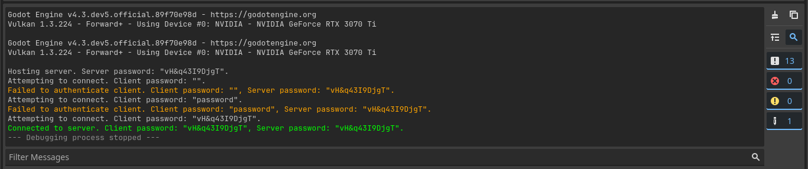

# Godot Multiplayer Password Example

Multiplayer example on how to connect and authenticate clients with server password.  
Ejemplo multijugador sobre cómo conectar y autenticar clientes con la contraseña del servidor.

This example is only basic authentication. It can be improved with encrypting the password via Crypto hashing.  
Este ejemplo es solo autenticación básica. Se puede mejorar cifrando la contraseña mediante hash criptográfico.  
https://github.com/Faless/gd-mp-password-auth/blob/main/password_auth.gd
